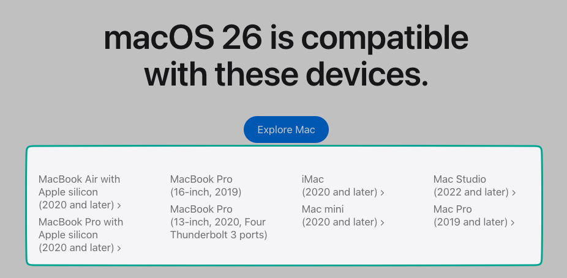

# macOS Tahoe Notes

On June 9th 2025, macOS unveiled macOS 26, aka macOS Tahoe. Seemingly, Apple decided to drop the version-based naming scheme (macOS 16 would have been the next logical version) to a year-based scheme (26 as in 2026)… I am already not a fan.

## (Officially) Supported Mac Models

**Source**: https://www.apple.com/os/macos/

## Intel CPU requirements:

-  Coffee Lake or newer

## New features

- Nothing really noteable besided an overhaul of Spotlight

## OpenCore Patcher Support

- Unknown yet. Waiting for official statements by Dortania et. al.
